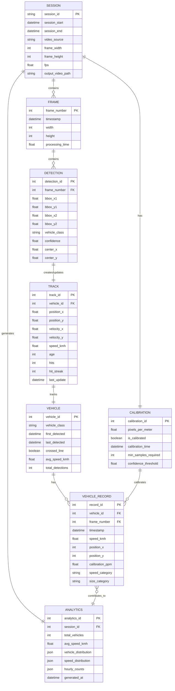

# Entity Relationship Diagram - Enhanced Traffic Monitoring System

## Visual ER Diagram (Mermaid)



## Text-Based ER Diagram

```
┌─────────────────────────────────────────────────────────────────┐
│                         TRAFFIC MONITORING SYSTEM                │
└─────────────────────────────────────────────────────────────────┘

┌──────────────┐
│   SESSION    │
├──────────────┤
│ session_id PK│
│ session_start│
│ session_end  │
│ video_source │
│ frame_width  │
│ frame_height │
│ fps          │
└──────┬───────┘
       │
       ├─────────────────┐
       │                 │
       │                 │
┌──────▼───────┐   ┌─────▼──────┐
│ CALIBRATION │   │   FRAME     │
├─────────────┤   ├────────────┤
│ calib_id PK │   │ frame_no PK│
│ pixels/meter│   │ timestamp   │
│ is_calib    │   │ width       │
└─────────────┘   │ height      │
                 └──────┬───────┘
                        │
                        │
                 ┌──────▼────────┐
                 │  DETECTION    │
                 ├───────────────┤
                 │ detection_id  │
                 │ bbox coords   │
                 │ vehicle_class │
                 │ confidence    │
                 └──────┬────────┘
                        │
                        │
                 ┌──────▼──────┐
                 │    TRACK    │
                 ├─────────────┤
                 │ track_id PK │
                 │ position    │
                 │ velocity    │
                 │ speed_kmh   │
                 └──────┬───────┘
                        │
                        │
                 ┌──────▼──────┐
                 │   VEHICLE   │
                 ├─────────────┤
                 │ vehicle_id  │
                 │ class       │
                 │ avg_speed   │
                 │ crossed_line│
                 └──────┬───────┘
                        │
                        │
                 ┌──────▼──────────┐
                 │ VEHICLE_RECORD │
                 ├────────────────┤
                 │ record_id PK   │
                 │ timestamp      │
                 │ speed_kmh      │
                 │ position       │
                 │ calibration_ppm│
                 └──────┬─────────┘
                        │
                        │
                 ┌──────▼────────┐
                 │  ANALYTICS    │
                 ├───────────────┤
                 │ analytics_id  │
                 │ total_vehicles│
                 │ avg_speed     │
                 │ distributions │
                 └───────────────┘
```

## Relationship Summary

| Relationship | Type | Description |
|-------------|------|-------------|
| SESSION → CALIBRATION | 1:1 | Each session has one calibration configuration |
| SESSION → FRAME | 1:N | A session contains many video frames |
| SESSION → ANALYTICS | 1:1 | Each session generates one analytics report |
| FRAME → DETECTION | 1:N | Each frame can have multiple vehicle detections |
| DETECTION → TRACK | 1:1 | Each detection creates or updates a track |
| TRACK → VEHICLE | 1:1 | Each track corresponds to one unique vehicle |
| VEHICLE → VEHICLE_RECORD | 1:N | A vehicle can have multiple recorded data points |
| VEHICLE_RECORD → ANALYTICS | N:1 | Multiple records contribute to analytics |
| CALIBRATION → VEHICLE_RECORD | 1:N | Calibration is used for all vehicle records |

## Key Attributes

### Primary Keys (PK)
- `session_id` - Unique session identifier
- `calibration_id` - Unique calibration instance
- `frame_number` - Sequential frame number
- `detection_id` - Unique detection identifier
- `track_id` - Unique tracking identifier
- `vehicle_id` - Unique vehicle identifier
- `record_id` - Unique record identifier
- `analytics_id` - Unique analytics identifier

### Foreign Keys (FK)
- `frame_number` in DETECTION references FRAME
- `vehicle_id` in TRACK references VEHICLE
- `vehicle_id` in VEHICLE_RECORD references VEHICLE
- `frame_number` in VEHICLE_RECORD references FRAME
- `session_id` in ANALYTICS references SESSION

## Data Flow Process

1. **Session Initialization**
   - Create SESSION entity
   - Initialize CALIBRATION entity

2. **Frame Processing Loop**
   - For each FRAME:
     - Run YOLO detection → Create DETECTION entities
     - Update SORT tracker → Create/Update TRACK entities
     - Associate TRACK with VEHICLE entity

3. **Vehicle Crossing Detection**
   - When vehicle crosses detection line:
     - Create VEHICLE_RECORD entity
     - Use CALIBRATION for speed calculation

4. **Analytics Generation**
   - Aggregate VEHICLE_RECORD entities
   - Generate ANALYTICS entity with statistics

## Implementation Notes

- **In-Memory Storage**: Current implementation uses Python data structures (dicts, deques) rather than a database
- **CSV Export**: VEHICLE_RECORD entities are exported to CSV files
- **Real-time Processing**: Entities are created and updated in real-time during video processing
- **Buffer Management**: Uses circular buffers (deque) to limit memory usage

