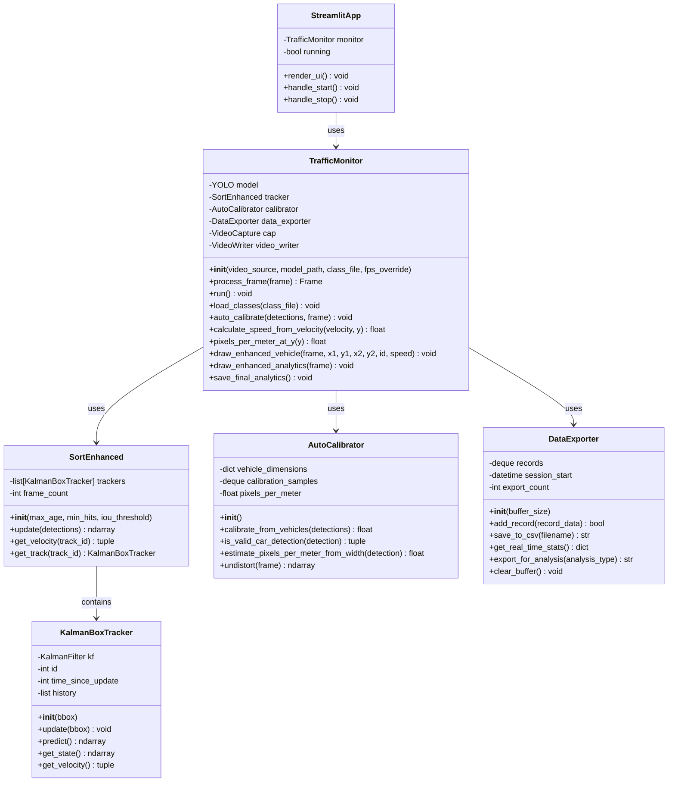

# Module Design - Enhanced Traffic Monitoring System

## Overview

This document describes the modular design of the Enhanced Traffic Monitoring System, including class structures, interfaces, dependencies, and interactions between modules.

## Module Structure

```
enhanced-traffic-monitoring/
├── app.py                    # Presentation Layer
├── enhanced_test.py          # Application Layer (TrafficMonitor)
├── sort_enhanced.py          # Tracking Module
├── calibration.py           # Calibration Module
└── data_export.py           # Data Export Module
```

## Class Diagram



## Module 1: Presentation Layer (`app.py`)

### Purpose
Provides web-based user interface using Streamlit framework.

### Components
- **Streamlit Application**: Main UI controller
- **Session State Management**: Manages application state
- **UI Components**: Sidebar, video display, analytics dashboard

### Key Functions

```python
# Main application flow
st.set_page_config(...)          # Page configuration
st.title(...)                    # Page title
st.sidebar.*                     # Sidebar controls
st.columns([2, 1])              # Layout columns
st.image(...)                   # Video display
st.metric(...)                  # Statistics display
```

### Interface
- **Input**: User interactions (button clicks, file uploads, configuration)
- **Output**: Rendered UI, video stream, analytics dashboard

### Dependencies
- `streamlit`
- `enhanced_test.TrafficMonitor`
- `cv2` (OpenCV)
- `numpy`

## Module 2: Application Layer (`enhanced_test.py`)

### Purpose
Main application controller that orchestrates all processing modules.

### Class: TrafficMonitor

#### Attributes

| Attribute | Type | Description |
|-----------|------|-------------|
| `model` | YOLO | YOLO v11 detection model |
| `tracker` | SortEnhanced | Multi-object tracker |
| `calibrator` | AutoCalibrator | Calibration module |
| `data_exporter` | DataExporter | Data export module |
| `cap` | VideoCapture | Video input source |
| `video_writer` | VideoWriter | Video output writer |
| `fps` | float | Frames per second |
| `frame_width` | int | Video frame width |
| `frame_height` | int | Video frame height |
| `pixels_per_meter` | float | Calibration ratio |
| `is_calibrated` | bool | Calibration status |
| `vehicle_info` | dict | Vehicle class mapping |
| `prev_speed` | dict | Previous speed values |
| `prev_positions` | dict | Previous positions |

#### Methods

##### `__init__(video_source, model_path='yolo11n.pt', class_file='coco.names', fps_override=None)`
- **Purpose**: Initialize TrafficMonitor
- **Parameters**:
  - `video_source`: Video source (0 for webcam, path for file)
  - `model_path`: Path to YOLO model file
  - `class_file`: Path to class names file
  - `fps_override`: Optional FPS override
- **Returns**: None

##### `process_frame(frame) -> ndarray`
- **Purpose**: Process a single video frame
- **Parameters**:
  - `frame`: Input frame (BGR image)
- **Returns**: Processed frame with annotations
- **Process**:
  1. Undistort frame
  2. Run YOLO detection
  3. Update SORT tracker
  4. Calculate speeds
  5. Auto-calibrate if needed
  6. Draw annotations
  7. Export data on line crossing

##### `calculate_speed_from_velocity(velocity_pixels_per_frame, y=None) -> float`
- **Purpose**: Convert velocity to real-world speed
- **Parameters**:
  - `velocity_pixels_per_frame`: Velocity in pixels per frame
  - `y`: Y-coordinate for perspective correction
- **Returns**: Speed in km/h

##### `pixels_per_meter_at_y(y) -> float`
- **Purpose**: Get pixels-per-meter ratio at given Y coordinate
- **Parameters**:
  - `y`: Y-coordinate
- **Returns**: Pixels per meter (perspective-corrected)

##### `auto_calibrate(detections, frame) -> void`
- **Purpose**: Automatic calibration using vehicle dimensions
- **Parameters**:
  - `detections`: List of detections
  - `frame`: Current frame
- **Returns**: None

##### `draw_enhanced_vehicle(frame, x1, y1, x2, y2, obj_id, speed_kmh) -> void`
- **Purpose**: Draw vehicle bounding box and speed
- **Parameters**:
  - `frame`: Frame to draw on
  - `x1, y1, x2, y2`: Bounding box coordinates
  - `obj_id`: Vehicle ID
  - `speed_kmh`: Speed in km/h
- **Returns**: None

##### `draw_enhanced_analytics(frame) -> void`
- **Purpose**: Draw analytics overlay on frame
- **Parameters**:
  - `frame`: Frame to draw on
- **Returns**: None

##### `save_final_analytics() -> void`
- **Purpose**: Save final analytics to CSV and JSON
- **Returns**: None

##### `run() -> void`
- **Purpose**: Main processing loop
- **Returns**: None

### Dependencies
- `ultralytics.YOLO`
- `cv2` (OpenCV)
- `sort_enhanced.SortEnhanced`
- `calibration.AutoCalibrator`
- `data_export.DataExporter`
- `numpy`
- `collections.defaultdict, deque`

## Module 3: Tracking Module (`sort_enhanced.py`)

### Purpose
Multi-object tracking using SORT algorithm with Kalman filtering.

### Class: SortEnhanced

#### Attributes

| Attribute | Type | Description |
|-----------|------|-------------|
| `trackers` | list[KalmanBoxTracker] | List of active trackers |
| `frame_count` | int | Frame counter |
| `max_age` | int | Maximum age before track deletion |
| `min_hits` | int | Minimum hits for track confirmation |
| `iou_threshold` | float | IOU threshold for association |

#### Methods

##### `__init__(max_age=30, min_hits=3, iou_threshold=0.3)`
- **Purpose**: Initialize SORT tracker
- **Parameters**:
  - `max_age`: Maximum frames without update
  - `min_hits`: Minimum detections for track
  - `iou_threshold`: IOU threshold for matching
- **Returns**: None

##### `update(detections) -> ndarray`
- **Purpose**: Update tracker with new detections
- **Parameters**:
  - `detections`: Array of detections [x1, y1, x2, y2, score]
- **Returns**: Array of tracks [x1, y1, x2, y2, id]
- **Process**:
  1. Predict track positions
  2. Associate detections to tracks (IOU)
  3. Update matched tracks
  4. Create new tracks for unmatched detections
  5. Remove old tracks

##### `get_velocity(track_id) -> tuple`
- **Purpose**: Get velocity for a track
- **Parameters**:
  - `track_id`: Track ID
- **Returns**: (vx, vy) velocity tuple in pixels/frame

##### `get_track(track_id) -> KalmanBoxTracker`
- **Purpose**: Get tracker object for ID
- **Parameters**:
  - `track_id`: Track ID
- **Returns**: KalmanBoxTracker object

### Class: KalmanBoxTracker

#### Attributes

| Attribute | Type | Description |
|-----------|------|-------------|
| `kf` | KalmanFilter | Kalman filter instance |
| `id` | int | Unique tracker ID |
| `time_since_update` | int | Frames since last update |
| `history` | list | Track history |
| `hits` | int | Number of detections |
| `hit_streak` | int | Consecutive hits |
| `age` | int | Track age |

#### Methods

##### `__init__(bbox)`
- **Purpose**: Initialize tracker with bounding box
- **Parameters**:
  - `bbox`: [x1, y1, x2, y2] bounding box
- **Returns**: None

##### `update(bbox) -> void`
- **Purpose**: Update tracker with new detection
- **Parameters**:
  - `bbox`: [x1, y1, x2, y2] bounding box
- **Returns**: None

##### `predict() -> ndarray`
- **Purpose**: Predict next state
- **Returns**: Predicted bounding box

##### `get_state() -> ndarray`
- **Purpose**: Get current state estimate
- **Returns**: [x, y, s, r, vx, vy, vs] state vector

##### `get_velocity() -> tuple`
- **Purpose**: Extract velocity from Kalman state
- **Returns**: (vx, vy) velocity tuple

### Helper Functions

##### `iou_batch(bb_test, bb_gt) -> ndarray`
- **Purpose**: Calculate IOU between bounding boxes
- **Parameters**:
  - `bb_test`: Test bounding boxes
  - `bb_gt`: Ground truth bounding boxes
- **Returns**: IOU matrix

##### `linear_assignment(cost_matrix) -> ndarray`
- **Purpose**: Solve linear assignment problem
- **Parameters**:
  - `cost_matrix`: Cost matrix
- **Returns**: Assignment pairs

##### `associate_detections_to_trackers(detections, trackers, iou_threshold) -> tuple`
- **Purpose**: Associate detections to trackers
- **Parameters**:
  - `detections`: Detection array
  - `trackers`: Tracker array
  - `iou_threshold`: IOU threshold
- **Returns**: (matches, unmatched_dets, unmatched_trks)

### Dependencies
- `filterpy.kalman.KalmanFilter`
- `numpy`
- `lap` (or `scipy.optimize.linear_sum_assignment`)

## Module 4: Calibration Module (`calibration.py`)

### Purpose
Automatic camera calibration using vehicle dimensions.

### Class: AutoCalibrator

#### Attributes

| Attribute | Type | Description |
|-----------|------|-------------|
| `vehicle_dimensions` | dict | Standard vehicle dimensions |
| `calibration_samples` | deque | Calibration sample buffer |
| `min_samples_for_calibration` | int | Minimum samples needed |
| `confidence_threshold` | float | Detection confidence threshold |
| `camera_matrix` | ndarray | Camera intrinsic matrix |
| `dist_coeffs` | ndarray | Distortion coefficients |
| `homography` | ndarray | Homography matrix |

#### Methods

##### `__init__()`
- **Purpose**: Initialize calibrator
- **Returns**: None

##### `calibrate_from_vehicles(detections) -> float`
- **Purpose**: Calibrate from vehicle detections
- **Parameters**:
  - `detections`: List of vehicle detections
- **Returns**: Pixels per meter ratio (or None)
- **Process**:
  1. Validate detections
  2. Estimate pixels per meter from each
  3. Filter outliers
  4. Calculate median/mean
  5. Return calibration ratio

##### `is_valid_car_detection(detection) -> tuple`
- **Purpose**: Validate detection for calibration
- **Parameters**:
  - `detection`: Detection dictionary
- **Returns**: (is_valid: bool, reason: str)

##### `estimate_pixels_per_meter_from_width(detection) -> float`
- **Purpose**: Estimate calibration from car width
- **Parameters**:
  - `detection`: Car detection
- **Returns**: Pixels per meter (or None)

##### `undistort(frame) -> ndarray`
- **Purpose**: Undistort frame using camera parameters
- **Parameters**:
  - `frame`: Input frame
- **Returns**: Undistorted frame

### Dependencies
- `numpy`
- `cv2` (OpenCV)
- `collections.deque`
- `statistics`

## Module 5: Data Export Module (`data_export.py`)

### Purpose
Data collection, buffering, and export functionality.

### Class: DataExporter

#### Attributes

| Attribute | Type | Description |
|-----------|------|-------------|
| `records` | deque | Circular buffer of records |
| `csv_headers` | list | CSV column headers |
| `session_start` | datetime | Session start time |
| `export_count` | int | Number of exports |

#### Methods

##### `__init__(buffer_size=1000)`
- **Purpose**: Initialize data exporter
- **Parameters**:
  - `buffer_size`: Maximum buffer size
- **Returns**: None

##### `add_record(record_data) -> bool`
- **Purpose**: Add vehicle record to buffer
- **Parameters**:
  - `record_data`: Dictionary with record fields
    - `timestamp`: ISO timestamp string
    - `vehicle_id`: int
    - `vehicle_class`: str
    - `speed_kmh`: float
    - `position_x`: int
    - `position_y`: int
    - `frame_number`: int
    - `calibration_ppm`: float
- **Returns**: Success boolean

##### `save_to_csv(filename=None) -> str`
- **Purpose**: Save records to CSV file
- **Parameters**:
  - `filename`: Output filename (optional)
- **Returns**: Filename of saved file

##### `get_real_time_stats() -> dict`
- **Purpose**: Get real-time statistics
- **Returns**: Dictionary with:
  - `total_vehicles`: int
  - `avg_speed`: float
  - `vehicle_distribution`: dict
  - `speed_distribution`: dict

##### `export_for_analysis(analysis_type) -> str`
- **Purpose**: Export data for specific analysis
- **Parameters**:
  - `analysis_type`: "anomaly_detection" or "traffic_flow"
- **Returns**: Filename of exported file

##### `add_computed_columns(df) -> DataFrame`
- **Purpose**: Add computed columns to DataFrame
- **Parameters**:
  - `df`: Pandas DataFrame
- **Returns**: DataFrame with added columns

##### `categorize_speed(speed_kmh) -> str`
- **Purpose**: Categorize speed
- **Parameters**:
  - `speed_kmh`: Speed value
- **Returns**: Category ("slow", "moderate", "fast", "very_fast")

##### `categorize_vehicle_size(vehicle_class) -> str`
- **Purpose**: Categorize vehicle by size
- **Parameters**:
  - `vehicle_class`: Vehicle class name
- **Returns**: Size category ("small", "medium", "large")

##### `print_export_summary(df) -> void`
- **Purpose**: Print export statistics
- **Parameters**:
  - `df`: DataFrame to summarize
- **Returns**: None

##### `clear_buffer() -> void`
- **Purpose**: Clear record buffer
- **Returns**: None

### Dependencies
- `pandas`
- `numpy`
- `datetime`
- `collections.deque`

## Module Interactions

### Data Flow Between Modules

```
┌─────────────┐
│   app.py    │  (Presentation)
└──────┬──────┘
       │ creates
       ▼
┌──────────────────┐
│ TrafficMonitor   │  (Application)
└──────┬───────────┘
       │
       ├──────────────┬──────────────┬──────────────┐
       │              │              │              │
       ▼              ▼              ▼              ▼
┌──────────┐  ┌──────────────┐  ┌──────────┐  ┌──────────┐
│   YOLO   │  │ SortEnhanced │  │AutoCalib │  │DataExport│
│  Model   │  │   Tracker   │  │          │  │          │
└────┬─────┘  └──────┬───────┘  └────┬─────┘  └────┬─────┘
     │               │                │            │
     │               │                │            │
     └───────────────┴────────────────┴────────────┘
                     │
                     ▼
              ┌──────────────┐
              │   Output     │
              │  (Video/CSV) │
              └──────────────┘
```

### Method Call Sequence

```
1. app.py: User clicks "Start"
   ↓
2. TrafficMonitor.__init__()
   ├─→ Load YOLO model
   ├─→ Initialize SortEnhanced
   ├─→ Initialize AutoCalibrator
   └─→ Initialize DataExporter
   ↓
3. TrafficMonitor.run()
   ↓
4. Loop: For each frame
   ├─→ TrafficMonitor.process_frame(frame)
   │   ├─→ AutoCalibrator.undistort(frame)
   │   ├─→ YOLO model detection
   │   ├─→ SortEnhanced.update(detections)
   │   │   └─→ KalmanBoxTracker.update() for each track
   │   ├─→ SortEnhanced.get_velocity(track_id)
   │   ├─→ TrafficMonitor.calculate_speed_from_velocity()
   │   ├─→ AutoCalibrator.calibrate_from_vehicles() (if needed)
   │   ├─→ DataExporter.add_record() (on line crossing)
   │   └─→ Draw annotations
   └─→ Write frame to video
   ↓
5. TrafficMonitor.save_final_analytics()
   └─→ DataExporter.save_to_csv()
```

## Interface Specifications

### TrafficMonitor Interface

```python
class TrafficMonitor:
    def __init__(self, video_source, model_path='yolo11n.pt', 
                 class_file='coco.names', fps_override=None)
    
    def process_frame(self, frame: np.ndarray) -> np.ndarray
    
    def calculate_speed_from_velocity(self, velocity_pixels_per_frame: float, 
                                      y: float = None) -> float
    
    def pixels_per_meter_at_y(self, y: float) -> float
    
    def auto_calibrate(self, detections: list, frame: np.ndarray) -> None
    
    def draw_enhanced_vehicle(self, frame: np.ndarray, x1: int, y1: int, 
                             x2: int, y2: int, obj_id: int, 
                             speed_kmh: float) -> None
    
    def save_final_analytics(self) -> None
    
    def run(self) -> None
```

### SortEnhanced Interface

```python
class SortEnhanced:
    def __init__(self, max_age: int = 30, min_hits: int = 3, 
                 iou_threshold: float = 0.3)
    
    def update(self, detections: np.ndarray) -> np.ndarray
    
    def get_velocity(self, track_id: int) -> tuple[float, float]
    
    def get_track(self, track_id: int) -> KalmanBoxTracker
```

### AutoCalibrator Interface

```python
class AutoCalibrator:
    def __init__(self)
    
    def calibrate_from_vehicles(self, detections: list) -> float | None
    
    def is_valid_car_detection(self, detection: dict) -> tuple[bool, str]
    
    def estimate_pixels_per_meter_from_width(self, detection: dict) -> float | None
    
    def undistort(self, frame: np.ndarray) -> np.ndarray
```

### DataExporter Interface

```python
class DataExporter:
    def __init__(self, buffer_size: int = 1000)
    
    def add_record(self, record_data: dict) -> bool
    
    def save_to_csv(self, filename: str = None) -> str | None
    
    def get_real_time_stats(self) -> dict
    
    def export_for_analysis(self, analysis_type: str) -> str | None
    
    def clear_buffer(self) -> None
```

## Data Structures

### Detection Format

```python
detection = {
    'bbox': [x1, y1, x2, y2],  # Bounding box coordinates
    'class': 'car',            # Vehicle class
    'confidence': 0.85,       # Detection confidence
    'width': 120,             # Bounding box width (pixels)
    'height': 80              # Bounding box height (pixels)
}
```

### Track Format

```python
track = np.array([
    x1, y1, x2, y2, track_id  # Bounding box + ID
])
```

### Vehicle Record Format

```python
record = {
    'timestamp': '2025-12-14T10:30:15.123',
    'vehicle_id': 1,
    'vehicle_class': 'car',
    'speed_kmh': 45.2,
    'position_x': 640,
    'position_y': 360,
    'frame_number': 1500,
    'calibration_ppm': 35.8
}
```

## Design Patterns

### 1. **Facade Pattern**
- `TrafficMonitor` acts as a facade, providing a simple interface to complex subsystems (YOLO, SORT, Calibration, Export)

### 2. **Strategy Pattern**
- Different calibration strategies (width-based, height-based) can be swapped

### 3. **Observer Pattern**
- `DataExporter` observes vehicle crossings and records data

### 4. **Template Method Pattern**
- `process_frame()` defines the algorithm skeleton, delegating steps to specialized modules

## Module Coupling

| Module | Coupling Level | Dependencies |
|--------|---------------|--------------|
| `app.py` | Low | Only depends on `TrafficMonitor` |
| `enhanced_test.py` | Medium | Depends on all core modules |
| `sort_enhanced.py` | Low | Self-contained, minimal dependencies |
| `calibration.py` | Low | Self-contained, minimal dependencies |
| `data_export.py` | Low | Self-contained, minimal dependencies |

## Module Cohesion

- **High Cohesion**: Each module has a single, well-defined responsibility
- **Loose Coupling**: Modules interact through well-defined interfaces
- **Separation of Concerns**: Clear boundaries between presentation, application, and processing logic

## Extension Points

### Adding New Vehicle Classes
1. Update `coco.names` file
2. Add to `vehicle_classes` list in `TrafficMonitor`
3. Add dimensions to `AutoCalibrator.vehicle_dimensions`

### Adding New Export Formats
1. Extend `DataExporter` class
2. Add new export method (e.g., `export_to_json()`, `export_to_database()`)

### Adding New Tracking Algorithms
1. Create new tracker class implementing same interface
2. Replace `SortEnhanced` in `TrafficMonitor.__init__()`

### Adding New Calibration Methods
1. Add new method to `AutoCalibrator`
2. Call from `TrafficMonitor.auto_calibrate()`

---

**Last Updated**: 2025-12-14  
**Version**: 1.0  
**Author**: Enhanced Traffic Monitoring System

