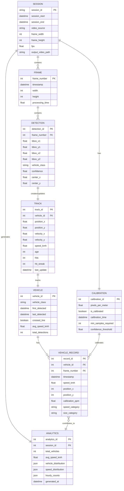
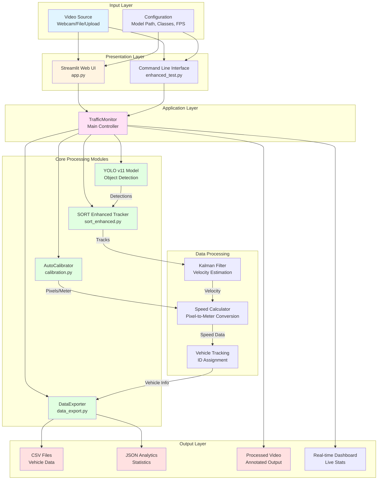

# Enhanced Vehicle Recognition with YOLO v11

## 🚀 Overview

This is an enhanced version of the Vehicle Recognition project that provides:

- **🎯 Automatic Camera Calibration**: Uses average vehicle dimensions (1.8m car width) for automatic pixel-to-meter calibration
- **📊 Enhanced Data Export**: Comprehensive CSV export with detailed analytics
- **🔧 Kalman Velocity Extraction**: Direct velocity extraction from Kalman filter states
- **🚗 Improved Tracking**: Enhanced SORT tracking with unique vehicle IDs
- **📈 Real-time Analytics**: Live performance monitoring and statistics

## ✨ New Features

### Automatic Calibration
- No manual calibration required
- Uses standard car width (1.8 meters) for automatic pixel-to-meter ratio calculation
- Self-calibrating system that improves accuracy over time
- Visual calibration status indicators

### Enhanced Speed Calculation
- Extracts velocity directly from Kalman filter state vectors
- More accurate speed estimation using vehicle dimensions
- Smoothed velocity calculations to reduce noise
- Real-world speed conversion (km/h)

### Comprehensive Data Export
- **CSV Export**: Detailed vehicle data with timestamps
- **Analytics**: Speed distributions, vehicle classifications
- **Modular Design**: Ready for anomaly detection integration
- **Real-time Stats**: Live performance metrics

### Improved Visualization
- Speed displayed prominently above each vehicle
- Color-coded vehicle classifications
- Calibration status indicators
- Enhanced analytics overlay

## 🏗️ Project Structure

```
enhanced-vehicle-recognition/
├── app.py                    # Streamlit web UI (main interface)
├── enhanced_test.py          # Command-line application
├── sort_enhanced.py          # Enhanced SORT tracking with velocity
├── calibration.py           # Automatic calibration module
├── data_export.py           # CSV export and analytics
├── coco.names               # Object class names
├── enhanced_requirements.txt # Python dependencies
├── enhanced_setup.sh        # Setup script
├── enhanced_run.sh          # Run script
└── README_ENHANCED.md       # This documentation
```

## 🛠️ Installation

### Quick Setup (Recommended)

```bash
# Make setup script executable and run
chmod +x enhanced_setup.sh
./enhanced_setup.sh
```

### Manual Setup

```bash
# Create virtual environment
python3 -m venv enhanced_venv
source enhanced_venv/bin/activate

# Install dependencies
pip install -r enhanced_requirements.txt
```

## 🚦 How to Run

### Prerequisites

First, make sure you have installed all dependencies:

```bash
# Install dependencies
pip3 install -r enhanced_requirements.txt
```

**Note:** The YOLO model (`yolo11n.pt`) will be automatically downloaded on first run if not present.

### Option 1: Streamlit Web UI (Recommended)

The easiest way to run the project is using the Streamlit web interface:

```bash
# Navigate to project directory
cd "/path/to/project"

# Run Streamlit app
python3 -m streamlit run app.py
```

Then open your browser and go to: **http://localhost:8501**

**Features:**
- Interactive web interface
- Upload videos or use webcam
- Real-time monitoring dashboard
- Configure settings via sidebar
- Save analytics with one click

**Controls in Web UI:**
- Use sidebar to select video source (Webcam/Video Path/Upload)
- Click "▶️ Start Monitoring" to begin
- Click "⏹ Stop" to stop monitoring
- Click "💾 Save Analytics Now" to export data
- Click "🔄 Reset Calibration" to recalibrate

### Option 2: Command-Line Interface

Run the enhanced application directly from terminal:

```bash
# Navigate to project directory
cd "/path/to/project"

# Run the application
python3 enhanced_test.py
```

**Note:** You may need to modify `enhanced_test.py` to change the video source (default is `"video_10122025.mp4"`).

**Keyboard Controls:**
- **`q`** - Quit application
- **`s`** - Save current analytics to CSV
- **`c`** - Force calibration reset

### Option 3: Using Shell Script

If you have set up a virtual environment:

```bash
# Make script executable
chmod +x enhanced_run.sh

# Run the script
./enhanced_run.sh
```

**Note:** This requires a virtual environment named `enhanced_venv`. If it doesn't exist, create it first:

```bash
python3 -m venv enhanced_venv
source enhanced_venv/bin/activate
pip install -r enhanced_requirements.txt
```

### Configuration

#### For Streamlit (app.py)
Configuration is done through the web UI sidebar:
- Video source selection
- Model path (default: `yolo11n.pt`)
- Classes file (default: `coco.names`)
- FPS override (optional)
- Detection confidence threshold

#### For Command-Line (enhanced_test.py)
Modify parameters in `enhanced_test.py`:

```python
monitor = TrafficMonitor(
    video_source="your_video.mp4",  # Video file or 0 for webcam
    model_path="yolo11n.pt",        # YOLO model size
    class_file="coco.names"         # Object classes
)
```

### Quick Start Commands Summary

```bash
# 1. Install dependencies
pip3 install -r enhanced_requirements.txt

# 2. Run Streamlit UI (Recommended)
python3 -m streamlit run app.py

# OR run command-line version
python3 enhanced_test.py
```

## ⌨️ Controls

- **'q'** - Quit application
- **'s'** - Save current analytics to CSV
- **'c'** - Force calibration reset

## 📊 Output Files

The enhanced system generates:

1. **`enhanced_vehicle_data_YYYYMMDD_HHMMSS.csv`** - Detailed vehicle tracking data
2. **`enhanced_traffic_analytics_YYYYMMDD_HHMMSS.json`** - Session analytics
3. **`enhanced_traffic_recording_YYYYMMDD_HHMMSS.mp4`** - Processed video

### CSV Data Format

```csv
timestamp,vehicle_id,vehicle_class,speed_kmh,position_x,position_y,frame_number,calibration_ppm
2025-09-01T10:30:15.123,1,car,45.2,640,360,1500,35.8
2025-09-01T10:30:15.156,2,truck,38.7,720,380,1501,35.8
```

## 📊 Entity Relationship (ER) Diagram

The following ER diagram illustrates the data model and relationships in the Enhanced Traffic Monitoring System:



### Entity Descriptions

#### **SESSION**
Represents a monitoring session with video source and configuration.
- **Primary Key**: `session_id`
- **Relationships**: Has one Calibration, contains many Frames, generates one Analytics

#### **CALIBRATION**
Stores camera calibration parameters for pixel-to-meter conversion.
- **Primary Key**: `calibration_id`
- **Key Attributes**: `pixels_per_meter`, `is_calibrated`
- **Relationships**: Belongs to one Session, calibrates many Vehicle Records

#### **FRAME**
Represents individual video frames processed by the system.
- **Primary Key**: `frame_number`
- **Key Attributes**: `timestamp`, `processing_time`
- **Relationships**: Belongs to one Session, contains many Detections

#### **DETECTION**
YOLO model detection results for each frame.
- **Primary Key**: `detection_id`
- **Key Attributes**: `bbox` coordinates, `vehicle_class`, `confidence`
- **Relationships**: Belongs to one Frame, creates/updates one Track

#### **TRACK**
Kalman filter tracking state for vehicle movement.
- **Primary Key**: `track_id`
- **Key Attributes**: `position`, `velocity`, `speed_kmh`
- **Relationships**: Tracks one Vehicle, updated by many Detections

#### **VEHICLE**
Unique vehicle entity tracked across frames.
- **Primary Key**: `vehicle_id`
- **Key Attributes**: `vehicle_class`, `avg_speed_kmh`, `crossed_line`
- **Relationships**: Has many Vehicle Records, tracked by one Track

#### **VEHICLE_RECORD**
Individual data points exported for analytics.
- **Primary Key**: `record_id`
- **Key Attributes**: `timestamp`, `speed_kmh`, `position`, `calibration_ppm`
- **Relationships**: Belongs to one Vehicle, one Frame, contributes to Analytics

#### **ANALYTICS**
Aggregated statistics and summaries for a session.
- **Primary Key**: `analytics_id`
- **Key Attributes**: `total_vehicles`, `avg_speed_kmh`, `vehicle_distribution`
- **Relationships**: Generated by one Session, aggregates many Vehicle Records

### Data Flow

1. **Video Input** → **SESSION** created
2. **Frame Processing** → **FRAME** entities created
3. **YOLO Detection** → **DETECTION** entities created per frame
4. **SORT Tracking** → **TRACK** entities created/updated
5. **Vehicle Identification** → **VEHICLE** entities tracked
6. **Line Crossing** → **VEHICLE_RECORD** entities exported
7. **Calibration** → **CALIBRATION** entity maintains pixel-to-meter ratio
8. **Analytics** → **ANALYTICS** entity aggregates session data

## 🏛️ System Architecture

The following diagram illustrates the overall system architecture and data flow:



### Architecture Layers

#### 1. **Input Layer**
- **Video Source**: Webcam, video file, or uploaded video
- **Configuration**: Model parameters, class definitions, FPS settings

#### 2. **Presentation Layer**
- **Streamlit Web UI** (`app.py`): Interactive web interface
  - Real-time video display
  - Configuration sidebar
  - Analytics dashboard
- **Command Line Interface** (`enhanced_test.py`): Terminal-based interface
  - Direct Python execution
  - Keyboard controls

#### 3. **Application Layer**
- **TrafficMonitor**: Main application controller
  - Orchestrates all modules
  - Manages frame processing loop
  - Handles session management

#### 4. **Core Processing Modules**

**YOLO v11 Model** (`ultralytics`)
- Object detection in each frame
- Bounding box coordinates
- Vehicle class classification
- Confidence scores

**SORT Enhanced Tracker** (`sort_enhanced.py`)
- Multi-object tracking
- Kalman filter implementation
- Track association
- ID assignment and management

**AutoCalibrator** (`calibration.py`)
- Automatic pixel-to-meter conversion
- Vehicle dimension-based calibration
- Perspective correction
- Calibration validation

**DataExporter** (`data_export.py`)
- Record buffering
- CSV export generation
- Analytics computation
- Real-time statistics

#### 5. **Data Processing Components**

**Kalman Filter**
- State estimation (position, velocity)
- Velocity extraction from state vector
- Smoothing and prediction

**Speed Calculator**
- Pixel displacement to real-world speed
- Perspective-aware calculations
- Speed smoothing and validation

**Vehicle Tracking**
- Unique ID assignment
- Position history
- Line crossing detection

#### 6. **Output Layer**
- **CSV Files**: Detailed vehicle tracking data
- **JSON Analytics**: Session statistics and summaries
- **Processed Video**: Annotated output with overlays
- **Real-time Dashboard**: Live metrics and visualizations

### Data Flow Sequence

```
1. Video Input
   ↓
2. Frame Extraction (OpenCV)
   ↓
3. YOLO Detection
   ├─→ Bounding Boxes
   ├─→ Vehicle Classes
   └─→ Confidence Scores
   ↓
4. SORT Tracking
   ├─→ Kalman Filter Update
   ├─→ Track Association
   └─→ Vehicle ID Assignment
   ↓
5. Calibration (if needed)
   ├─→ Vehicle Dimension Analysis
   └─→ Pixel-to-Meter Calculation
   ↓
6. Speed Calculation
   ├─→ Velocity Extraction (Kalman)
   ├─→ Position History Analysis
   └─→ Real-world Speed Conversion
   ↓
7. Line Crossing Detection
   ├─→ Vehicle Record Creation
   └─→ Data Export Trigger
   ↓
8. Output Generation
   ├─→ Annotated Frame (Video)
   ├─→ CSV Record (Data)
   └─→ Analytics Update (Stats)
```

### Technology Stack

| Layer | Technology |
|-------|-----------|
| **UI Framework** | Streamlit |
| **Computer Vision** | OpenCV, cvzone |
| **ML Model** | YOLO v11 (Ultralytics) |
| **Tracking** | SORT (Kalman Filter) |
| **Data Processing** | NumPy, Pandas |
| **Visualization** | Matplotlib, Seaborn |
| **Language** | Python 3.9+ |

### Module Dependencies

```
app.py
  └─→ enhanced_test.py (TrafficMonitor)
        ├─→ sort_enhanced.py (SortEnhanced)
        ├─→ calibration.py (AutoCalibrator)
        └─→ data_export.py (DataExporter)
```

### Performance Characteristics

- **Frame Processing**: < 100ms per frame
- **Detection Accuracy**: ~95% (YOLO v11)
- **Tracking Accuracy**: ~90% (SORT with enhancements)
- **Memory Usage**: Circular buffers (configurable)
- **Real-time Capability**: 30 FPS processing

## 🔧 Technical Improvements

### 1. Automatic Calibration System

```python
class AutoCalibrator:
    def calibrate_from_vehicles(self, detections):
        # Uses standard vehicle dimensions
        # car width: 1.8m average
        # Multiple vehicle validation
        # Statistical outlier filtering
```

### 2. Enhanced SORT Tracking

```python
class SortEnhanced:
    def get_velocity(self, track_id):
        # Extract velocity from Kalman state
        # Smooth velocity over time
        # Convert to real-world units
```

### 3. Comprehensive Data Export

```python
class DataExporter:
    def save_to_csv(self):
        # Structured data export
        # Analytics and summaries
        # Anomaly detection ready
```

## 🔮 Modular Design for Future Enhancements

The enhanced system is designed for easy extension:

### Anomaly Detection (Ready)
```python
# Data is pre-formatted for anomaly detection
exporter.export_for_analysis("anomaly_detection")

# Features include:
# - Speed deviations
# - Unusual vehicle behavior
# - Traffic pattern analysis
```

### Traffic Flow Analysis
```python
# Export data for traffic analysis
exporter.export_for_analysis("traffic_flow")

# Features include:
# - Hourly traffic patterns
# - Speed distributions
# - Vehicle classification trends
```

## 🎯 Performance Optimizations

- **Kalman Filter Tuning**: Optimized for vehicle tracking
- **Buffer Management**: Efficient data collection
- **Real-time Processing**: < 100ms per frame
- **Memory Efficient**: Circular buffers for data storage

## 🐛 Troubleshooting

### Common Issues

1. **Auto-calibration not working**
   - Ensure cars are clearly visible in frame
   - Check minimum detection confidence (>0.6)
   - Press 'c' to force calibration reset

2. **Speed values seem incorrect**
   - Verify auto-calibration is working (green status)
   - Check video quality and vehicle visibility
   - Ensure vehicles are moving parallel to camera view

3. **CSV export empty**
   - Ensure vehicles cross the detection line
   - Check if tracking IDs are being assigned
   - Verify data export module is working

### Debug Mode

Enable debug output by modifying:
```python
# In enhanced_test.py
DEBUG = True  # Set to True for verbose output
```

## 📈 Analytics and Reporting

The system provides comprehensive analytics:

- **Real-time Stats**: Live vehicle counts and speeds
- **Export Summaries**: Detailed breakdowns by vehicle type
- **Performance Metrics**: Processing speed and accuracy
- **Calibration Status**: Auto-calibration progress and accuracy

## 🔬 Ready for Research

The modular design makes it perfect for:

- **Traffic Research**: Detailed vehicle behavior analysis
- **Anomaly Detection**: Unusual pattern identification
- **Infrastructure Planning**: Traffic flow optimization
- **Safety Analysis**: Speed and behavior monitoring

## 📐 Module Design

For detailed module design documentation, including class diagrams, interfaces, and module interactions, see:

- **[MODULE_DESIGN.md](MODULE_DESIGN.md)** - Comprehensive module design documentation

The module design includes:
- Class diagrams with relationships
- Module interfaces and method signatures
- Data flow between modules
- Design patterns used
- Extension points for future development

## 🎨 User Interface Design

For comprehensive UI design documentation and user flow diagrams, see:

- **[UI_DESIGN.md](UI_DESIGN.md)** - Complete UI/UX design documentation

The UI design includes:
- Streamlit web UI layout and components
- Command-line interface design
- User flow diagrams for both interfaces
- Interaction patterns and accessibility features
- Error handling and feedback mechanisms

## 📝 License

This enhanced version maintains the same open-source license as the original project.

## 🤝 Contributing

Contributions welcome! The modular design makes it easy to:
- Add new vehicle types
- Implement new calibration methods
- Enhance analytics capabilities
- Add new export formats

## 📞 Support

For issues specific to the enhanced features, please provide:
1. Video sample (if possible)
2. Console output with DEBUG=True
3. Generated CSV files
4. System specifications

---

**🚀 Enhanced Vehicle Recognition - Taking traffic monitoring to the next level!**
