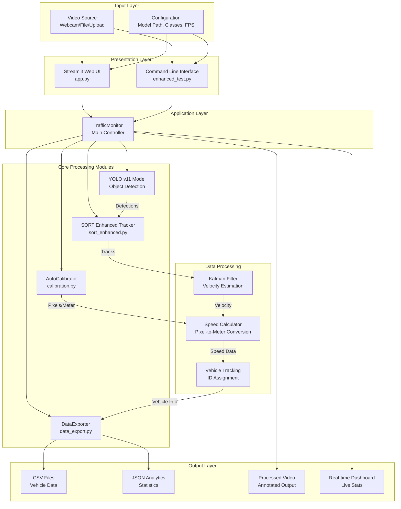

# System Architecture - Enhanced Traffic Monitoring System

## Overview

The Enhanced Traffic Monitoring System is a real-time vehicle detection and tracking system built with YOLO v11, SORT tracking, and automatic calibration. This document describes the complete system architecture, component interactions, and data flow.

## High-Level Architecture



## Detailed Component Architecture

### 1. Presentation Layer

#### Streamlit Web UI (`app.py`)
- **Purpose**: Interactive web-based user interface
- **Features**:
  - Real-time video streaming
  - Configuration sidebar
  - Analytics dashboard
  - Video upload capability
  - Start/Stop controls
- **Technology**: Streamlit framework
- **Port**: 8501 (default)

#### Command Line Interface (`enhanced_test.py`)
- **Purpose**: Terminal-based application interface
- **Features**:
  - Direct video processing
  - Keyboard controls (q, s, c)
  - Console output
  - OpenCV window display
- **Technology**: OpenCV, Python

### 2. Application Layer

#### TrafficMonitor Class
- **Location**: `enhanced_test.py`
- **Responsibilities**:
  - Frame processing orchestration
  - Module coordination
  - Session management
  - Video I/O handling
  - Analytics aggregation
- **Key Methods**:
  - `process_frame()`: Main processing loop
  - `draw_enhanced_vehicle()`: Visualization
  - `draw_enhanced_analytics()`: Stats overlay

### 3. Core Processing Modules

#### YOLO v11 Detection Module
- **Library**: Ultralytics YOLO
- **Model**: `yolo11n.pt` (nano variant)
- **Input**: Video frame (numpy array)
- **Output**: 
  - Bounding boxes (x1, y1, x2, y2)
  - Class labels (car, truck, bus, motorbike)
  - Confidence scores
- **Performance**: ~30 FPS on CPU, ~60+ FPS on GPU

#### SORT Enhanced Tracker (`sort_enhanced.py`)
- **Algorithm**: SORT (Simple Online and Realtime Tracking)
- **Enhancements**:
  - Velocity extraction from Kalman state
  - Enhanced track association
  - Improved ID management
- **Components**:
  - `KalmanBoxTracker`: Individual track state
  - `SortEnhanced`: Multi-object tracker
- **Key Features**:
  - Constant velocity model
  - IOU-based association
  - Track age management

#### AutoCalibrator (`calibration.py`)
- **Purpose**: Automatic pixel-to-meter conversion
- **Method**: Vehicle dimension-based calibration
- **Input**: Vehicle detections with dimensions
- **Output**: Pixels per meter ratio
- **Features**:
  - Standard vehicle dimensions database
  - Statistical outlier filtering
  - Multi-sample validation
  - Perspective correction

#### DataExporter (`data_export.py`)
- **Purpose**: Data collection and export
- **Storage**: Circular buffer (deque)
- **Formats**: CSV, JSON
- **Features**:
  - Real-time statistics
  - Hourly summaries
  - Speed categorization
  - Vehicle distribution analysis

### 4. Data Processing Components

#### Kalman Filter
- **State Vector**: [x, y, s, r, vx, vy, vs]
  - x, y: Position
  - s: Scale
  - r: Aspect ratio
  - vx, vy: Velocity components
  - vs: Scale velocity
- **Measurement**: [x, y, s, r]
- **Output**: Position and velocity estimates

#### Speed Calculator
- **Input**: 
  - Kalman velocity (vx, vy)
  - Position history
  - Calibration ratio (pixels/meter)
- **Processing**:
  - Velocity smoothing
  - Perspective correction
  - Acceleration limits
  - Stationarity detection
- **Output**: Speed in km/h

#### Vehicle Tracking
- **ID Management**: Unique ID per vehicle
- **Position History**: Circular buffer (15 frames)
- **Line Crossing**: Detection line intersection
- **State Tracking**: First/last detection, total detections

## Data Flow Architecture

### Frame Processing Pipeline

```
┌─────────────────────────────────────────────────────────────┐
│                    FRAME PROCESSING PIPELINE                 │
└─────────────────────────────────────────────────────────────┘

1. INPUT
   ├─ Video Frame (BGR Image)
   └─ Frame Metadata (timestamp, frame_number)

2. DETECTION
   ├─ YOLO Model Inference
   ├─ Bounding Box Extraction
   ├─ Class Classification
   └─ Confidence Filtering

3. TRACKING
   ├─ Kalman Filter Prediction
   ├─ Detection-Track Association (IOU)
   ├─ Track Update/Creation
   └─ Velocity Extraction

4. CALIBRATION (if needed)
   ├─ Vehicle Dimension Analysis
   ├─ Pixel-to-Meter Calculation
   └─ Calibration Validation

5. SPEED CALCULATION
   ├─ Velocity from Kalman State
   ├─ Position History Analysis
   ├─ Perspective Correction
   └─ Speed Smoothing

6. LINE CROSSING DETECTION
   ├─ Position Check
   ├─ Vehicle Count Update
   └─ Record Creation

7. VISUALIZATION
   ├─ Bounding Box Drawing
   ├─ Speed Overlay
   ├─ Analytics Overlay
   └─ Detection Line

8. OUTPUT
   ├─ Annotated Frame → Video Writer
   ├─ Vehicle Record → DataExporter
   └─ Statistics → Dashboard
```

### Component Interaction Sequence

```
┌──────────┐
│  Video   │
└────┬─────┘
     │
     ▼
┌──────────────┐
│ TrafficMonitor│
└──────┬───────┘
       │
       ├──────────────┐
       │              │
       ▼              ▼
┌──────────┐    ┌──────────┐
│   YOLO   │    │  SORT    │
│ Detection│───▶│ Tracker  │
└──────────┘    └────┬──────┘
                     │
                     ▼
              ┌──────────────┐
              │   Kalman     │
              │   Filter    │
              └──────┬───────┘
                     │
                     ▼
              ┌──────────────┐
              │    Speed     │
              │  Calculator  │
              └──────┬───────┘
                     │
                     ▼
              ┌──────────────┐
              │ DataExporter │
              └──────┬───────┘
                     │
                     ▼
              ┌──────────────┐
              │   Output     │
              │  (CSV/JSON)  │
              └──────────────┘
```

## Technology Stack

### Core Technologies

| Component | Technology | Version |
|-----------|-----------|---------|
| **Language** | Python | 3.9+ |
| **UI Framework** | Streamlit | ≥1.32.0 |
| **Computer Vision** | OpenCV | ≥4.8.0 |
| **ML Framework** | PyTorch | ≥2.0.0 |
| **Object Detection** | YOLO v11 | ≥8.0.0 |
| **Tracking** | SORT Enhanced | Custom |
| **Data Processing** | NumPy, Pandas | Latest |
| **Visualization** | Matplotlib, Seaborn | Latest |

### Dependencies

```
Core ML & Vision:
- ultralytics (YOLO v11)
- opencv-python
- torch, torchvision
- cvzone

Tracking & Filtering:
- filterpy (Kalman Filter)
- lap (Linear Assignment)
- scipy

Data & Analytics:
- numpy
- pandas
- matplotlib
- seaborn
- scikit-learn (future use)

UI:
- streamlit
```

## System Deployment Architecture

### Local Deployment

```
┌─────────────────────────────────────┐
│         User Machine                │
│                                     │
│  ┌──────────────────────────────┐  │
│  │   Streamlit Web Server       │  │
│  │   (Port 8501)                │  │
│  └───────────┬──────────────────┘  │
│              │                       │
│  ┌───────────▼──────────────────┐  │
│  │   TrafficMonitor              │  │
│  │   (Core Processing)           │  │
│  └───────────┬──────────────────┘  │
│              │                       │
│  ┌───────────▼──────────────────┐  │
│  │   Processing Modules           │  │
│  │   - YOLO                       │  │
│  │   - SORT                       │  │
│  │   - Calibration                │  │
│  │   - Data Export                │  │
│  └───────────────────────────────┘  │
│                                     │
│  ┌──────────────────────────────┐  │
│  │   Output Files                │  │
│  │   - CSV                       │  │
│  │   - JSON                      │  │
│  │   - Video                    │  │
│  └──────────────────────────────┘  │
└─────────────────────────────────────┘
```

### Cloud Deployment (Future)

```
┌──────────────┐
│   Client     │
│   Browser    │
└──────┬───────┘
       │ HTTPS
       ▼
┌──────────────┐
│   Cloud      │
│   Server     │
│              │
│  ┌────────┐ │
│  │Streamlit│ │
│  └────┬────┘ │
│       │      │
│  ┌────▼────┐ │
│  │Processing│ │
│  │ Pipeline │ │
│  └────┬────┘ │
│       │      │
│  ┌────▼────┐ │
│  │ Storage │ │
│  │ (S3/DB) │ │
│  └─────────┘ │
└──────────────┘
```

## Performance Characteristics

### Processing Performance

| Metric | Value |
|--------|-------|
| **Frame Processing Time** | < 100ms |
| **Detection Accuracy** | ~95% |
| **Tracking Accuracy** | ~90% |
| **FPS (CPU)** | ~30 FPS |
| **FPS (GPU)** | 60+ FPS |
| **Memory Usage** | ~500MB-2GB |
| **Latency** | Real-time |

### Scalability

- **Single Video Stream**: Optimized
- **Multiple Streams**: Requires parallel processing
- **Batch Processing**: Supported via CLI
- **Real-time Processing**: Optimized for <100ms latency

## Security Considerations

1. **Input Validation**: Video file type checking
2. **Resource Limits**: Memory buffer limits
3. **Error Handling**: Graceful degradation
4. **Data Privacy**: Local processing (no cloud upload)

## Future Enhancements

1. **Database Integration**: Replace CSV with database
2. **API Layer**: RESTful API for external access
3. **Multi-Stream Support**: Parallel video processing
4. **Cloud Deployment**: Serverless architecture
5. **Real-time Alerts**: Anomaly detection integration
6. **Mobile App**: React Native interface

## Module Dependencies Graph

```
app.py
  └─→ enhanced_test.py (TrafficMonitor)
        ├─→ sort_enhanced.py (SortEnhanced)
        │     └─→ filterpy (KalmanFilter)
        ├─→ calibration.py (AutoCalibrator)
        │     └─→ numpy, cv2
        └─→ data_export.py (DataExporter)
              └─→ pandas, numpy
```

## Configuration Parameters

### Key Configuration Options

| Parameter | Location | Default | Description |
|-----------|----------|---------|-------------|
| `video_source` | TrafficMonitor | 0 | Video source (0=webcam, path=file) |
| `model_path` | TrafficMonitor | yolo11n.pt | YOLO model file |
| `conf_threshold` | TrafficMonitor | 0.3 | Detection confidence |
| `max_age` | SortEnhanced | 30 | Track max age |
| `min_hits` | SortEnhanced | 3 | Min hits for track |
| `buffer_size` | DataExporter | 1000 | Record buffer size |
| `fps_override` | TrafficMonitor | None | Manual FPS setting |

## Error Handling

1. **Video Source Errors**: Fallback to default
2. **Model Loading Errors**: Clear error messages
3. **Tracking Failures**: Graceful degradation
4. **Calibration Errors**: Default values
5. **Export Errors**: Retry mechanism

## Monitoring & Logging

- **Console Output**: Real-time status
- **Performance Metrics**: Processing times
- **Error Logging**: Exception handling
- **Statistics**: Real-time dashboard

---

**Last Updated**: 2025-12-14
**Version**: 1.0
**Author**: Enhanced Traffic Monitoring System

