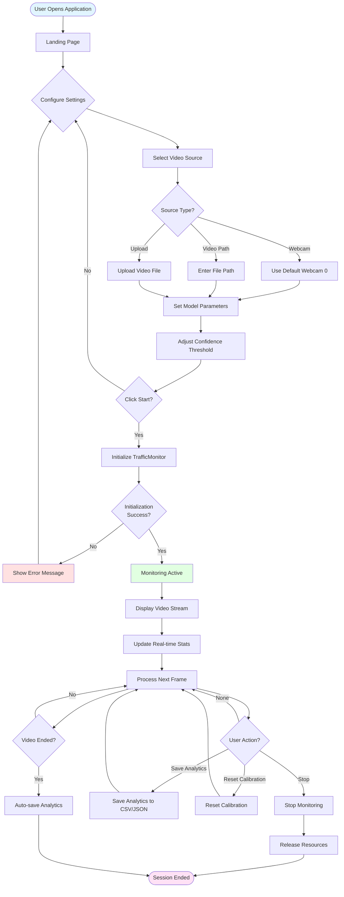
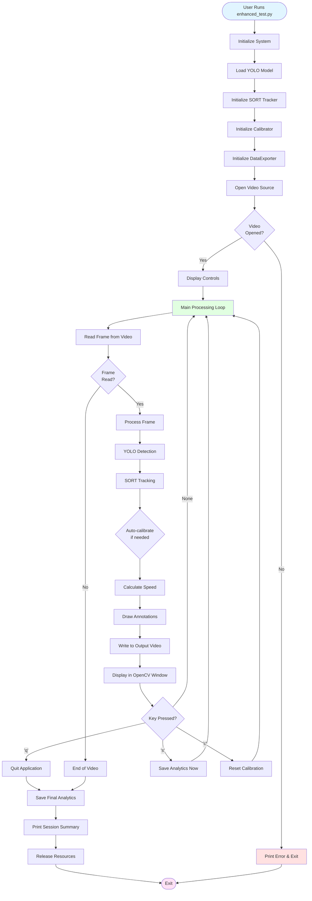
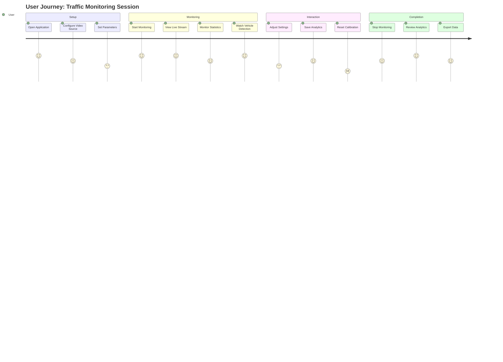

# User Interface Design - Enhanced Traffic Monitoring System

## Overview

The Enhanced Traffic Monitoring System provides two user interfaces:
1. **Streamlit Web UI** - Interactive web-based interface
2. **Command Line Interface (CLI)** - Terminal-based interface

## 1. Streamlit Web UI Design

### Design Philosophy

- **Modern & Professional**: Dark theme with traffic security aesthetic
- **Real-time Feedback**: Live video stream with instant statistics
- **User-Friendly**: Intuitive controls and clear visual hierarchy
- **Responsive**: Wide layout optimized for video monitoring

### Color Scheme

```css
--bg: #0b1220          /* Dark background */
--panel: #0f172a       /* Panel background */
--text: #e5e7eb        /* Primary text */
--danger: #ef4444      /* Red - alerts */
--warn: #f59e0b        /* Orange - warnings */
--safe: #22c55e         /* Green - success */
--accent: #3b82f6       /* Blue - primary actions */
```

### Layout Structure

```
┌─────────────────────────────────────────────────────────────┐
│  🚦 Enhanced Traffic Monitoring System                      │
│  🚧 Traffic Security Dashboard • Live Monitoring • Road Safety│
├─────────────────────────────────────────────────────────────┤
│                                                               │
│  ┌──────────────────────────┐  ┌──────────────────────┐   │
│  │                          │  │  📊 Real-time Stats   │   │
│  │                          │  │                       │   │
│  │   Video Display Area     │  │  Total Vehicles: 45   │   │
│  │   (Live Stream)          │  │  Avg Speed: 52.3 km/h │   │
│  │                          │  │                       │   │
│  │   [Annotated Video]      │  │  Vehicle Distribution│   │
│  │                          │  │  [Bar Chart]         │   │
│  │                          │  │                       │   │
│  │                          │  │  Speed Distribution  │   │
│  │                          │  │  [Bar Chart]         │   │
│  └──────────────────────────┘  └──────────────────────┘   │
│                                                               │
└─────────────────────────────────────────────────────────────┘
│  Sidebar (🛡️ Configuration)                                │
│  ┌─────────────────────────────────────────────────────┐   │
│  │ Video Source: ○ Webcam ○ Video Path ○ Upload Video │   │
│  │                                                       │   │
│  │ Model path: [yolo11n.pt]                            │   │
│  │ Classes file: [coco.names]                          │   │
│  │ FPS override: [0]                                   │   │
│  │ Detection confidence: [━━━━━━━━━━━━━━━━] 0.3       │   │
│  │                                                       │   │
│  │ [▶️ Start Monitoring]  [⏹ Stop]                    │   │
│  │                                                       │   │
│  │ ─────────────────────────────────────                │   │
│  │                                                       │   │
│  │ [💾 Save Analytics Now]                             │   │
│  │ [🔄 Reset Calibration]                               │   │
│  └─────────────────────────────────────────────────────┘   │
```

### Component Details

#### 1. Header Section

**Title**: "🚦 Enhanced Traffic Monitoring System"
- **Style**: Large, bold, light text color
- **Purpose**: Branding and identification

**Banner**: "🚧 Traffic Security Dashboard • Live Monitoring • Road Safety"
- **Style**: Gradient background (red → orange → green)
- **Purpose**: Visual appeal and feature highlights

#### 2. Sidebar (Configuration Panel)

**Location**: Left side, collapsible
**Background**: Dark (#0c1324)
**Width**: ~25% of screen width

**Components**:

1. **Video Source Selection** (Radio buttons)
   - Options: Webcam, Video Path, Upload Video
   - Default: Webcam
   - Behavior: Changes input method dynamically

2. **Video Path Input** (Text input)
   - Visible when "Video Path" selected
   - Placeholder: "C:/path/to/video.mp4"
   - Validation: File existence check

3. **File Uploader** (File upload)
   - Visible when "Upload Video" selected
   - Accepted types: mp4, mov, avi
   - Behavior: Saves to temporary file

4. **Model Configuration**
   - Model path: Text input (default: "yolo11n.pt")
   - Classes file: Text input (default: "coco.names")
   - FPS override: Number input (0-240, default: 0)

5. **Detection Settings**
   - Confidence threshold: Slider (0.1-0.9, default: 0.3, step: 0.05)
   - Visual feedback: Real-time value display

6. **Control Buttons**
   - Start Monitoring: Green gradient button
   - Stop: Red/orange gradient button
   - Layout: Two columns, full width

7. **Action Buttons**
   - Save Analytics Now: Full width
   - Reset Calibration: Full width
   - Separated by divider

#### 3. Main Content Area

**Layout**: Two columns (2:1 ratio)

##### Left Column: Video Display (66% width)

**Video Placeholder**
- **Size**: Responsive, container width
- **Border**: 3px gradient border (red → orange → green)
- **Border Radius**: 12px
- **Shadow**: Deep shadow for depth
- **Content**: Live annotated video stream
  - Bounding boxes with vehicle IDs
  - Speed labels above vehicles
  - Detection line overlay
  - Analytics overlay (top-left)
  - Calibration status indicator

**Video Annotations**:
- Vehicle bounding boxes (color-coded by class)
- Vehicle ID labels
- Speed display (km/h) above each vehicle
- Detection line (horizontal line)
- Frame counter
- FPS display
- Vehicle count

##### Right Column: Analytics Dashboard (33% width)

**Section**: "📊 Real-time Stats"

**Components**:

1. **Metrics Cards** (2 columns)
   - Total Vehicles (recent): Integer metric
   - Avg Speed (km/h): Float metric with 1 decimal
   - Style: Dark panel background, colored left border

2. **Vehicle Distribution Chart**
   - Type: Bar chart
   - Data: Vehicle class counts
   - Updates: Real-time
   - Colors: Class-specific

3. **Speed Distribution Chart**
   - Type: Bar chart
   - Data: Speed categories (slow, moderate, fast, very_fast)
   - Updates: Real-time
   - Colors: Gradient based on speed

### Visual Elements

#### Buttons

**Primary Actions** (Start, Save):
- Background: Gradient (green → blue)
- Text: White
- Border: None
- Border Radius: 10px
- Shadow: Subtle glow effect
- Hover: Slight brightness increase

**Secondary Actions** (Stop, Reset):
- Background: Gradient (red → orange)
- Text: White
- Border: None
- Border Radius: 10px

#### Metrics

- Background: Dark panel (#0f172a)
- Border: Left border (4px, orange)
- Padding: 0.75rem
- Border Radius: 12px
- Value: Large, light text
- Label: Smaller, gray text

#### Charts

- Background: Transparent (inherits page background)
- Colors: Theme-appropriate
- Updates: Smooth transitions
- Tooltips: On hover

### User Feedback

#### Success Messages
- Style: Green success banner
- Example: "Monitoring started", "Analytics saved"

#### Error Messages
- Style: Red error banner
- Example: "Failed to start monitoring: [error details]"

#### Warning Messages
- Style: Orange warning banner
- Example: "Monitoring stopped", "End of video stream"

#### Info Messages
- Style: Blue info banner
- Example: "Calibration reset"

### Responsive Design

- **Desktop**: Full layout with sidebar
- **Tablet**: Sidebar collapses to icon
- **Mobile**: Stacked layout (not optimized, but functional)

## 2. Command Line Interface (CLI) Design

### Interface Layout

```
┌─────────────────────────────────────────────────────────────┐
│  Enhanced Traffic Monitoring System                         │
│  ┌───────────────────────────────────────────────────────┐ │
│  │                                                         │ │
│  │              OpenCV Window                             │ │
│  │         (Video Display with Annotations)               │ │
│  │                                                         │ │
│  │  [Annotated Video Stream]                              │ │
│  │                                                         │ │
│  └───────────────────────────────────────────────────────┘ │
│                                                               │
│  Console Output:                                              │
│  🚀 Starting Enhanced Vehicle Recognition...                │
│  Controls:                                                    │
│    'q' - Quit                                                │
│    's' - Save current analytics                              │
│    'c' - Force calibration reset                            │
│                                                               │
│  📹 Video Resolution: 1920x1080                             │
│  ⚡ FPS: 30                                                  │
│  🎯 Auto-calibration successful: 35.8 pixels/meter          │
│                                                               │
└─────────────────────────────────────────────────────────────┘
```

### Console Output Format

#### Initialization Messages

```
🚗 Enhanced Vehicle Recognition System Initialized
📹 Video Resolution: 1920x1080
⚡ FPS: 30
📽️ Recording to: enhanced_traffic_recording_20251214_213142.mp4
🎯 AutoCalibrator initialized
📏 Reference dimensions loaded for car, truck, bus, motorbike
📊 DataExporter initialized
```

#### Runtime Messages

```
🎯 Auto-calibration successful: 35.8 pixels/meter
📈 Buffer: 100 records
💾 Saving current analytics...
✅ Exported 150 records to enhanced_vehicle_data_20251214_213500.csv
```

#### Control Instructions

```
🚀 Starting Enhanced Vehicle Recognition...
Controls:
  'q' - Quit
  's' - Save current analytics
  'c' - Force calibration reset
```

#### Session Summary

```
🏁 Session complete!

📈 SESSION SUMMARY:
   🚗 Total vehicles detected: 45
   ⏱️  Total runtime: 120.5 seconds
   🎯 Calibration: ✅ Auto-calibrated
   📏 Pixels per meter: 35.8
```

### Keyboard Controls

| Key | Action | Feedback |
|-----|--------|----------|
| `q` | Quit application | Console: "🛑 Stopping system..." |
| `s` | Save analytics | Console: "💾 Saving current analytics..." |
| `c` | Reset calibration | Console: "🔄 Resetting calibration..." |

### Video Window Features

- **Title**: "Enhanced Traffic Monitoring System"
- **Content**: Annotated video stream
- **Annotations**: Same as web UI
- **Controls**: Keyboard-based
- **Close**: 'q' key or window close button

## 3. User Flow Diagrams

### Streamlit Web UI User Flow



### CLI User Flow



### Complete User Journey



## 4. Interaction Patterns

### Pattern 1: Start Monitoring

1. User selects video source
2. User configures parameters (optional)
3. User clicks "Start Monitoring"
4. System validates inputs
5. System initializes TrafficMonitor
6. System begins processing
7. Video stream appears
8. Statistics update in real-time

### Pattern 2: Save Analytics

1. User clicks "Save Analytics Now"
2. System collects current data
3. System generates CSV file
4. System generates JSON file
5. System displays success message
6. Files saved to project directory

### Pattern 3: Reset Calibration

1. User clicks "Reset Calibration"
2. System resets calibration flag
3. System resets pixels_per_meter to default
4. System displays info message
5. System re-calibrates on next valid detections

### Pattern 4: Stop Monitoring

1. User clicks "Stop"
2. System stops processing loop
3. System releases video resources
4. System displays warning message
5. Video stream stops
6. Statistics freeze at last values

## 5. Accessibility Features

### Web UI
- **Keyboard Navigation**: Tab through controls
- **Screen Reader**: Semantic HTML elements
- **Color Contrast**: High contrast for readability
- **Text Size**: Scalable with browser zoom

### CLI
- **Keyboard Only**: Full keyboard control
- **Clear Messages**: Emoji and text for clarity
- **Error Messages**: Descriptive error text

## 6. Error Handling UI

### Web UI Error States

1. **Video Source Error**
   - Message: "Failed to start monitoring: [error]"
   - Style: Red error banner
   - Action: User can retry with different source

2. **Model Loading Error**
   - Message: "Model file not found"
   - Style: Red error banner
   - Action: User can specify correct path

3. **Video End**
   - Message: "End of video stream or cannot access source"
   - Style: Orange warning banner
   - Action: Auto-stops, user can start new session

### CLI Error States

1. **File Not Found**
   - Console: Error message with file path
   - Action: Program exits with error code

2. **Video Access Error**
   - Console: "Cannot access video source"
   - Action: Program exits gracefully

## 7. Performance Considerations

### Web UI
- **Frame Rate**: Limited by Streamlit refresh (~30 FPS)
- **Memory**: Circular buffers prevent memory leaks
- **Responsiveness**: Non-blocking UI updates

### CLI
- **Frame Rate**: Limited only by processing speed
- **Memory**: Efficient buffer management
- **Performance**: Optimized for real-time processing

## 8. Future UI Enhancements

### Planned Features
- **Multi-stream Support**: Monitor multiple cameras
- **Historical Data View**: View past analytics
- **Export Options**: Additional export formats
- **Customizable Layout**: User-configurable dashboard
- **Alert System**: Visual/audio alerts for anomalies
- **Mobile App**: Native mobile interface

---

**Last Updated**: 2025-12-14  
**Version**: 1.0  
**Author**: Enhanced Traffic Monitoring System

